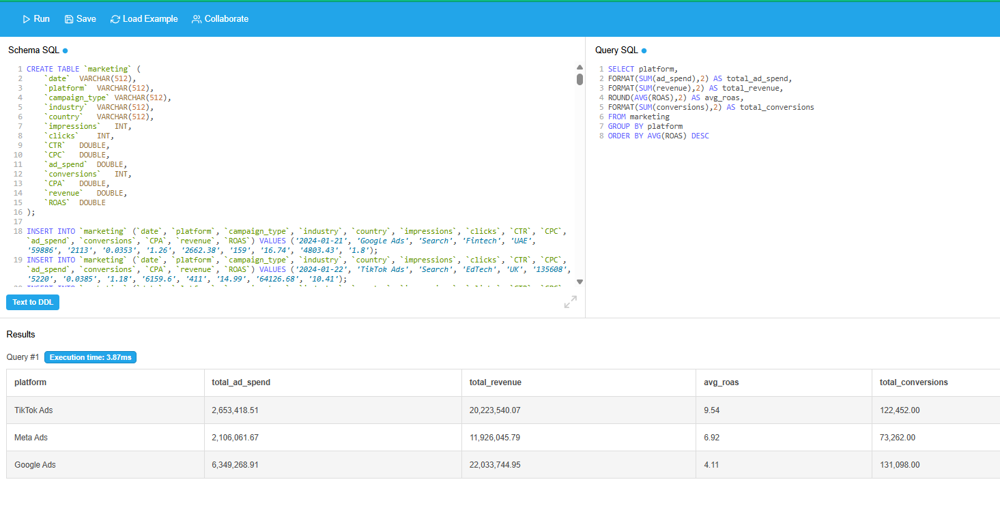
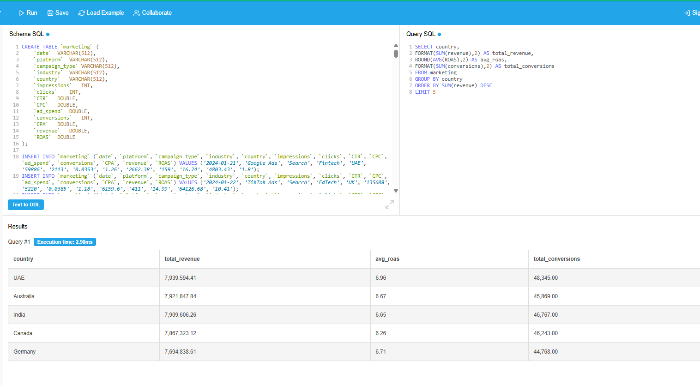
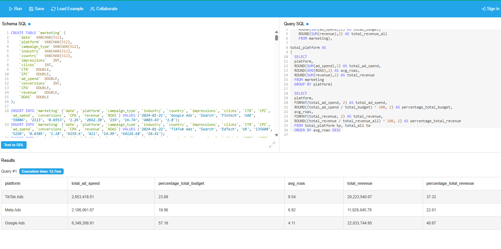
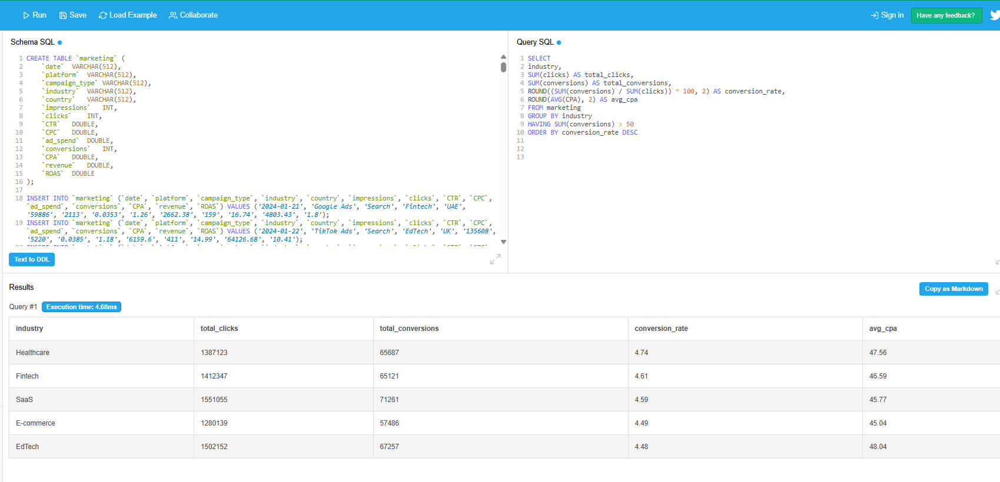

# 📊 Global Ads Performance Analysis


## 📋 Project Overview

SQL-based analysis of advertising performance across **Google Ads**, **Meta Ads**, and **TikTok Ads** using **MySQL v9**. Dataset contains **1,800 rows** of 2024 campaign data from Kaggle.

## 🎯 Business Objectives

- Evaluate which platform delivers the best ROI (ROAS)
- Identify top-performing markets by revenue
- Optimize budget allocation across platforms
- Rank top campaigns per platform
- Analyze industry conversion efficiency

## 📊 Dataset Description

**Source:** Kaggle - Global Ads Performance  
**Size:** 1,800 rows  
**Period:** January - December 2024  
**Platforms:** Google Ads, Meta Ads, TikTok Ads

The dataset contains campaign-level data including impressions, clicks, conversions, ad spend, revenue, and key metrics like ROAS, CPA, and CTR.

## 📈 Key Metrics Analyzed

**ROAS** (Return on Ad Spend), **CPA** (Cost Per Acquisition), **CTR** (Click-Through Rate), and **Conversion Rate**.

---

## 🔍 SQL Exercises

### Exercise 1: Overall Performance by Platform

**Business Question:** Which platform delivers the best ROI?

**SQL Query:**
```sql
SELECT platform,
ROUND(SUM(ad_spend),2) AS total_ad_spend, 
ROUND(SUM(revenue),2) AS total_revenue, 
ROUND(AVG(ROAS),2) AS avg_roas, 
SUM(conversions) AS total_conversions
FROM marketing
GROUP BY platform
ORDER BY AVG(ROAS) DESC
```

**Results:**



**Key Insights:**
- TikTok Ads has the highest average ROAS of 9.54
- Meta Ads generated the most revenue at $22,033,744.95
- TikTok Ads delivered 122,452 total conversions

---

### Exercise 2: Top 5 Countries with Best Performance

**Business Question:** Which markets are most profitable?

**SQL Query:**
```sql
SELECT country,
ROUND(SUM(revenue),2) AS total_revenue,
ROUND(AVG(ROAS),2) AS avg_roas,
SUM(conversions) AS total_conversions
FROM marketing
GROUP BY country
ORDER BY SUM(revenue) DESC
LIMIT 5
```

**Results:**



**Key Insights:**
- UAE is the top market with $7,939,594 in revenue
- UAE has the best ROAS at 6.96
- Top 5 countries generated $39.3M in combined revenue

---

### Exercise 3: Budget Allocation Analysis with CTE

**Business Question:** How is budget distributed across platforms and does it align with returns?

**SQL Query:**
```sql
WITH total_all AS (
    SELECT
        SUM(ad_spend) AS total_budget,
        SUM(revenue) AS total_revenue_all
    FROM marketing
),
total_platform AS (
    SELECT
        platform,
        SUM(ad_spend) AS total_ad_spend,
        AVG(ROAS) AS avg_roas,
        SUM(revenue) AS total_revenue
    FROM marketing
    GROUP BY platform
)
SELECT
    tp.platform,
    FORMAT(tp.total_ad_spend, 2) AS total_ad_spend,
    ROUND((tp.total_ad_spend / ta.total_budget) * 100, 2) AS percentage_total_budget,
    ROUND(tp.avg_roas, 2) AS avg_roas,
    FORMAT(tp.total_revenue, 2) AS total_revenue,
    ROUND((tp.total_revenue / ta.total_revenue_all) * 100, 2) AS percentage_total_revenue
FROM total_platform tp, total_all ta
ORDER BY tp.avg_roas DESC
```

**Results:**



**Key Insights:**
- TikTok Ads receives 23.89% of budget but generates 37.32% of revenue
- Budget allocation is misaligned with performance
- Recommend increasing investment in TikTok Ads (highest ROAS: 9.54)


---

### Exercise 4: Top 3 Campaigns per Platform (Window Function)

**Business Question:** What are the top 3 best-performing campaigns on each platform?

**SQL Query:**
```sql
SELECT date, platform, ROAS, best_campaigns
FROM (
    SELECT date, platform, ROAS,
    RANK() OVER (PARTITION BY platform ORDER BY ROAS DESC) AS best_campaigns
    FROM marketing
) AS ranked
WHERE best_campaigns <= 3
ORDER BY platform, best_campaigns
```

**Results:**



**Key Insights:**
- Top campaign on TikTok Ads achieved ROAS of 49.00 (highest overall)
- Google Ads shows most consistent performance (lowest variation between top campaigns)
- Best campaigns occurred during Q2 and Q3 (May-September)

---

### Exercise 5: Efficiency Analysis by Industry

**Business Question:** Which industries convert clicks to conversions most efficiently?

**SQL Query:**
```sql
SELECT
industry,
SUM(clicks) AS total_clicks,
SUM(conversions) AS total_conversions,
ROUND((SUM(conversions) / SUM(clicks)) * 100, 2) AS conversion_rate,
ROUND(AVG(CPA), 2) AS avg_cpa
FROM marketing
GROUP BY industry
HAVING SUM(conversions) > 50
ORDER BY conversion_rate DESC
```

**Results:**


**Key Insights:**
- Healthcare has the highest conversion rate at 4.74%
- E-commerce has the lowest CPA at $45.04
- Industries with >50 conversions show 4.58% average conversion rate

---

## 🛠️ Technologies Used

**SQL:** MySQL v9 | **Tool:** db-fiddle | **Source:** Kaggle | **Version Control:** GitHub

## 💡 Skills Demonstrated

Aggregations (SUM, AVG) • GROUP BY & HAVING • CTEs • Window Functions (RANK) • PARTITION BY • Subqueries • ROUND & FORMAT • Percentage Calculations • Marketing Metrics

---

## 📁 Repository Structure

```
global-ads-performance-sql/
├── README.md
├── queries.sql
└── screenshots/
    ├── exercise1_results.png
    ├── exercise2_results.png
    ├── exercise3_results.png
    ├── exercise5_results.png
    └── exercise6_results.png
```

---

## 👤 About

Marketing Data Analyst portfolio project demonstrating SQL proficiency in analyzing digital advertising performance data.

**Skills:** SQL • MySQL • Data Analysis • Marketing Analytics • ROAS Optimization

---

**Last Updated:** March 31, 2026
